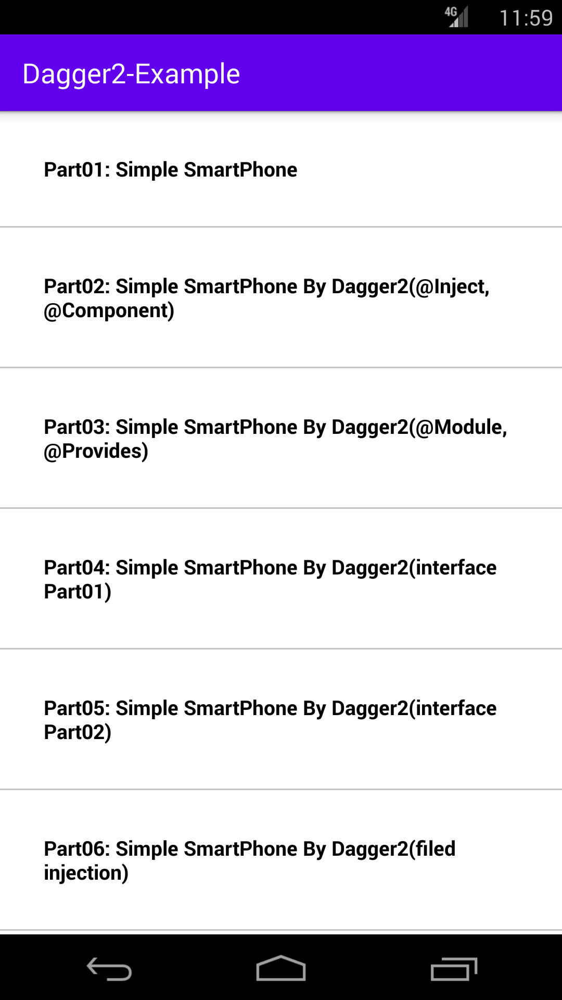
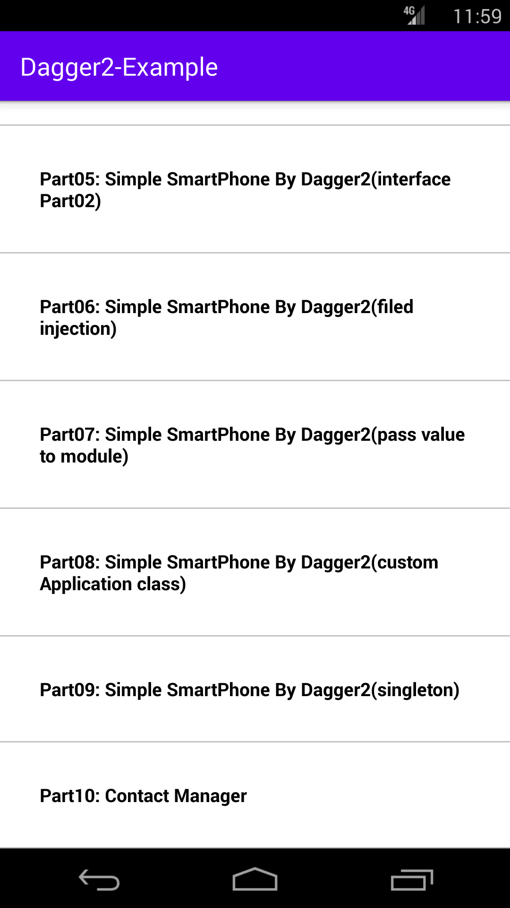

# dagger2-java-practice

#### developed by **Mahdi Razzaghi Ghaleh**
dagger2 simple practice by JAVA android

#### Dependency Injection :
The process of constructing required dependencies(objects/entities/instances)out side the dependent object and providing them to the dependent when needed.

##### SOLID
The term SOLID is an acronym for five design principles intended to make software design more understandable, flexible and maintainable.
##### S O L I D :
S: Single Responsibility Principle; A class should have only one job to do,That means a class should have only one reason to change. And to make a new change you need to change only one place.  
O: Open/Closed Principle; Objects should be open for extension but closed for modification.  
L: Liskov Substitution Principle; This principle is about child classes. Every child/sub class should be a substitution for their original parent class.  
I: Interface Segregation Principle; A client should never be forced to implement an interface that it doesn't use or a client shouldn't be forced to depend on methods that they do not use.
D: Dependency Inversion Principle; Entities must depend on abstraction, not on concretion.

#### What is Dagger 2?
Dagger 2 is dependency injection framework.  
It is based on the Java Specification Request (JSR) 330.  
It uses code generation and is based on annotations.  
The generated code is very relatively easy to read and debug.

#### some popular annotation in Dagger2:

##### @Module:
Used on classes which contains methods annotated with @Provides.

##### @Provides:
Can be used on methods in classes annotated with @Module and is used for methods which provides objects for dependencies injection.

##### @Singleton:
Single instance of this provided object is created and shared.

##### @Component:
Used on an interface.
This interface is used by Dagger 2 to generate code which uses the modules to fulfill the requested dependencies.

##### @Inject:
request dependencies. Can be used on a constructor, a field, or a method.You use the @Inject annotation to define a dependency.  
 If you annotate a constructor with @Inject, Dagger 2 can also use an instance of this object to fulfill dependencies.  
 This was done to avoid the definition of lots of @Provides methods for these objects.

